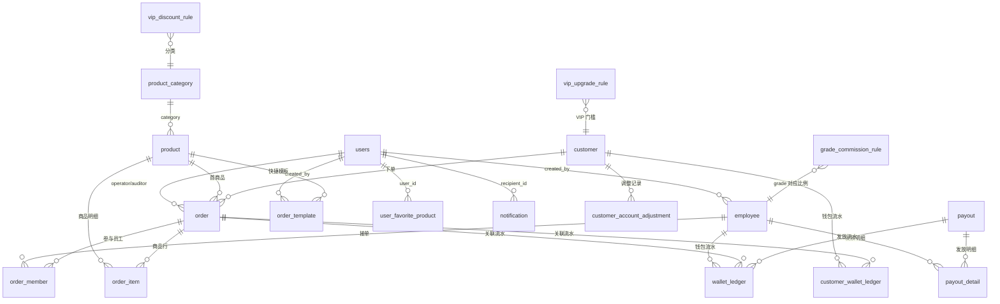

# Ex-Lend 员工提成与客户账户管理系统 —— 数据库介绍文档

> 来源文件：`G:\new-ui\ALL_IN_ONE.sql`（Supabase 一键初始化脚本，重建版 v3，已去重）
> 用途：介绍该脚本包含的**全部数据（表/枚举/种子数据）**与**全部业务逻辑（RPC 函数 / 触发器 / 权限策略）**。

---

## 1. 系统概述

Ex-Lend 是一套面向门店/服务行业（示例业务为"手游代练"类）的**员工提成与客户账户管理系统**，跑在 **Supabase（PostgreSQL）** 上。

核心业务：

- **员工**（接单员）按等级提成，提成进入员工钱包，老板可批量发放工资、手工调账；
- **客户**拥有"本金 + 赠送金"双余额钱包，可充值（套餐/自定义）、下单质押、退款；
- **订单**走完整生命周期：下单 → 指派 0~2 名员工 → 开始服务 → 完成 → 老板审核提成 → 入账；
- **VIP 体系**：按客户累计消费自动升级，享受按产品分类的折扣；
- **协作功能**：待办（@ 提及通知）、公告、共享便签、个人通知、实时订阅。

数据模型要点（记账式设计）：

- 所有金额变动都写**流水表**（`wallet_ledger`、`customer_wallet_ledger`），余额字段随流水同步更新，可追溯；
- 订单保存**快照**（客户类型、VIP 等级、商品、提成规则），审核时以快照为准，避免规则修改影响历史订单；
- 金额计算以**服务端为准**（RPC 函数重算总价，前端传值仅作可选覆盖且受范围校验）。

---

## 2. Supabase 能力使用情况

| 能力 | 用途 |
|---|---|
| PostgreSQL + pgcrypto | 表、枚举、约束、索引、`gen_random_uuid()` |
| 存储过程 / RPC | 所有敏感资金操作均封装为 `SECURITY DEFINER` 函数，由前端 `rpc()` 调用 |
| Row Level Security (RLS) | 全部业务表开启行级安全，按角色（boss/manager）控制读写 |
| Supabase Auth + Custom Claims | `custom_access_token_hook` 把 `users.role` 注入 JWT，供 RLS 判断 |
| Storage | `payment-proofs`（支付凭证）、`avatars`（头像）两个私有桶 |
| Realtime | `notification`、`note` 两张表加入 `supabase_realtime` 发布，支持实时订阅 |

---

## 3. 枚举类型（15 个）

| 枚举 | 取值 | 说明 |
|---|---|---|
| `user_role` | `boss`, `manager` | 系统用户角色：老板 / 管理岗 |
| `user_status` | `active`, `disabled` | 用户启停用 |
| `employee_status` | `active`, `resigned` | 员工在职 / 离职 |
| `product_status` | `on_sale`, `off_shelf` | 商品上架 / 下架 |
| `commission_type` | `fixed`, `grade` | 提成类型：固定比例 / 按等级比例 |
| `customer_type` | `normal`, `vip` | 客户类型：普通 / VIP |
| `customer_status` | `active`, `blocked` | 客户正常 / 拉黑停用 |
| `package_status` | `enabled`, `disabled` | 充值套餐启用 / 停用 |
| `order_status` | `booking`, `in_progress`, `completed`, `cancelled` | 订单状态：预约 → 进行中 → 已完成 → 已取消 |
| `audit_status` | `pending`, `approved`, `rejected` | 提成审核：待审核 / 已通过 / 已驳回 |
| `pay_method` | `wallet`, `cash` | 支付方式：钱包 / 现金 |
| `wallet_ledger_type` | `commission`, `payout`, `refund_deduct`, `adjust` | 员工钱包流水类型 |
| `customer_ledger_type` | `recharge_principal`, `recharge_bonus`, `consume_principal`, `consume_bonus`, `consume_from_pending`, `refund`, `adjust`, `cash_received`, `cash_refund` | 客户钱包流水类型 |
| `payout_status` | `processing`, `completed` | 发放批次状态 |
| `gender` | `male`, `female`, `other` | 员工性别（后续扩展） |
---

## 4. 数据表（25 张业务表 + 2 个存储桶）

### 4.1 基础规则表（无外键依赖，全局配置）

| 表 | 用途 | 关键字段 |
|---|---|---|
| `users` | 系统用户（老板/管理岗）。密码不由本表管理（`password_hash` 固定为 `auth-managed`，真实密码在 Supabase Auth） | `id, username, password_hash, name, role, status, avatar_path, bio, order_create_shortcut, created_at, updated_at` |
| `grade_commission_rule` | 等级提成规则：员工等级 → 提成比例（全局一份，如 1 级 80%、2 级 85%、3 级 90%） | `grade (unique), rate numeric(6,4) ∈ [0,1]` |
| `vip_discount_rule` | VIP 折扣规则：`vip_level × 分类` 二维折扣率（如 VIP1 × 某分类 0.9 折） | `vip_level, category/category_id, discount ∈ (0,1]`，`unique(vip_level, category)` |
| `vip_upgrade_rule` | VIP 升级门槛：等级对应的累计消费阈值 | `vip_level (unique), consumption_threshold` |
| `recharge_package` | 充值套餐：充值金额 + 赠送金额 | `amount > 0, bonus ≥ 0, status` |

### 4.2 主体表

| 表 | 用途 | 关键字段 |
|---|---|---|
| `employee` | 员工档案 + 钱包。基础字段外扩展了昵称、性别、支付宝、开户行、押金、微信号、备注、简介、头像 | `name, phone, id_card, hire_date, bank_card, grade ≥ 1, status, wallet_balance, is_debt(欠款), is_bad_debt(坏账), created_by` + 扩展列 |
| `product` | 商品/服务项目 | `category/category_id, name, price ≥ 0, commission_type(fixed/grade), fixed_rate, status(on_sale/off_shelf), image_url` |
| `customer` | 客户 + 双余额钱包 + 预收 + 累计消费 | `type(normal/vip), vip_level, principal_balance(本金), bonus_balance(赠送), pending_balance(预收/质押), overdraft_limit(透支额度), total_consumption(累计消费), status(active/blocked)` |

### 4.3 账务流水表（不可直接篡改，均由 RPC 写入）

| 表 | 用途 | 关键字段 |
|---|---|---|
| `wallet_ledger` | 员工钱包流水（提成入账 / 工资发放 / 审核冲回 / 手动调整） | `employee_id, type, amount, balance_after, order_id, payout_id, operator_id, remark`；按 employee/order/payout/created 建索引 |
| `customer_wallet_ledger` | 客户钱包流水（充值本金/赠送、消费扣减、预收、退款、调整、现金收退） | `customer_id, type, amount, principal_after, bonus_after, order_id, operator_id, proof_path, remark`；按 customer/order/created 建索引 |

### 4.4 订单与提成相关表

| 表 | 用途 | 关键字段 |
|---|---|---|
| `order` | 订单主表。`order_no` 唯一（`ORD+时间戳`）。保存客户类型/VIP 快照、各项金额、审核信息、支付凭证 | `customer_id, product_id(首商品), customer_type_snapshot, vip_level_snapshot, pay_method, original_amount, paid_amount, discount_amount, pending_amount, total_commission, gross_profit, status, audit_status, auditor_id, audited_at, operator_id, completed_at, proof_path, quantity` |
| `order_member` | 订单参与员工（0~2 名），保存提成快照与人工覆盖 | `order_id, employee_id, grade_snapshot, base_amount, applied_rate, commission_amount, commission_type_snapshot, commission_override_amount/by/at`；`unique(order_id, employee_id)` |
| `order_item` | 订单商品明细（多商品订单），保存不可变快照 | `order_id, product_id, product_name_snapshot, category_id/category_snapshot, unit_price, quantity, original_amount, discount_rate, discount_amount, paid_amount, commission_type_snapshot, fixed_rate_snapshot`；`unique(order_id, product_id)` |

### 4.5 发放（工资）相关表

| 表 | 用途 | 关键字段 |
|---|---|---|
| `payout` | 发放批次（老板对员工钱包批量扣减） | `batch_no, operator_id, total_amount, detail_count, status(processing/completed)` |
| `payout_detail` | 批次明细（每人发放多少、扣款前后余额） | `payout_id, employee_id, amount, balance_before, balance_after` |

### 4.6 调整记录 / 审计日志

| 表 | 用途 | 关键字段 |
|---|---|---|
| `customer_account_adjustment` | 客户账户人工调整留痕（VIP 等级、累计消费） | `customer_id, field(vip_level/total_consumption), amount, before_value, after_value, reason, operator_id` |
| `order_delete_log` | 订单删除审计日志（老板删除订单时记录，物理删除但留痕） | `order_id, order_no, deleted_by, paid_amount, status, audit_status, reason, deleted_at` |

### 4.7 扩展业务 / 协作功能表

| 表 | 用途 | 关键字段 |
|---|---|---|
| `product_category` | 商品分类（独立于商品管理，替代旧文本分类字段） | `name(unique), description, status(enabled/disabled)` |
| `order_template` | 个人快捷下单模板（个人设置） | `created_by, name, product_id, category_id, quantity, pay_method`；`unique(created_by, name)` |
| `user_favorite_product` | 个人常用商品收藏（新建订单快速选择） | `user_id, product_id, sort_order`；`unique(user_id, product_id)` |
| `system_setting` | 系统设置 KV（当前用于系统 Logo 路径） | `key(pk), value, updated_by, updated_at` |
| `todo_item` | 协作待办（全员可读写，可 @ 提及他人） | `title(1~160字), content, status(pending/in_progress/completed), mentioned_user_ids[]` |
| `announcement` | 公告（仅老板发布，全员可读） | `title, content, is_pinned, created_by, updated_by` |
| `notification` | 个人通知（待办提及、客户 VIP 自动升级；支持已读） | `recipient_id, type(todo_mention/customer_vip_upgrade), title, content, reference_type/id, read_at` |
| `note` | 协作便签（发布后全员可见，私有仅创建人可见） | `title, content, is_published, created_by, updated_by` |

### 4.8 Storage 存储桶

| 桶 | 可见性 | 说明 |
|---|---|---|
| `payment-proofs` | 私有 | 订单/流水支付凭证，上传路径要求首段 = 自己的 uid，删除仅限本人 |
| `avatars` | 私有 | 用户/员工/客户头像，上传路径首段 = 自己的 uid（未配置删除策略） |
---

## 5. 表关系（ER 概览）

---

## 6. 核心业务逻辑

### 6.1 订单全生命周期

1. **下单**（`create_order` / `create_order_multi`，员工级）
   - 校验：操作者为员工级（老板或管理岗）；商品在售；客户存在（多商品单要求客户 `active`）。
   - 金额计算（服务端权威）：`原价 = 商品单价 × 数量`；VIP 客户按 `vip_discount_rule`（按分类）打折，否则实付 = 前端传入值（必须在 0 ~ 原价之间，多商品单限 50 种商品、员工 0 或 2 名）。
   - 快照：订单写入客户类型/VIP 快照、金额、`pending_amount`；`order_item` 写入商品名称/分类/单价/折扣等不可变快照；`order_member` 写入参与员工。
   - **钱包支付（wallet）**：按客户"本金/赠送金"比例从钱包扣款（`consume_principal` / `consume_bonus` 流水，金额为负），同时 `pending_balance` 增加实付金额（质押）。
   - **现金支付（cash）**：`pending_balance` 增加实付金额，写 `cash_received` 流水（预收）。
   - 订单初始状态：`status = booking`，`audit_status = pending`。

2. **指派接单员工**（`assign_order_employees`，员工级）
   - 每单 0~2 名员工，不可重复、必须是**在职**员工；
   - 仅 `booking` + 待审核订单可改；**覆盖式**修改（先删后插）。

3. **开始服务**（`batch_start_orders`，员工级，批量）
   - 若存在 **booking + 待审核但没有员工** 的订单则报错；其余 booking + 待审核的订单批量更新 `status → in_progress`，其他状态的订单会被跳过。

4. **完成订单**（前端更新 `status = completed`）
   - 支付凭证可在 `in_progress` / `completed` 后通过 `update_order_proof` 上传/修改。

5. **老板审核提成**（`approve_commission`，仅老板，也可批量 `batch_approve_orders`）
   - 前置校验：订单已完成、待审核、有参与员工、有商品明细、参与员工等级都有提成规则。
   - 逐行计算：每人基数 `= 该商品行实付 / 参与人数`（均分）；固定提成商品按 `fixed_rate_snapshot`，等级提成商品按员工当前等级的 `grade_commission_rule.rate`；汇总为每人提成。
   - 写 `order_member` 快照（等级、基数、实际比例、提成金额）；员工钱包 `+提成` 并写 `wallet_ledger('commission')`。
   - 客户结算：`pending_balance −= 实付`，`total_consumption += 实付`（写 `consume_from_pending` 流水）；钱包单的"真实收入"按实际消费的本金部分计，现金单按实付计。
   - `order.total_commission = Σ提成`，`gross_profit = 真实收入 − 总提成`；订单 → `approved`。
   - **提成人工覆盖**：审核前可由员工级调用 `set_pending_order_commissions` 临时指定某员工的提成金额（存 `commission_override_*`），审核时若存在覆盖则用覆盖值替代计算值。

6. **撤销审核**（`reject_order_audit`，仅老板）
   - 把已审核订单恢复为"已完成 + 待审核"；员工钱包扣回提成并写 `refund_deduct` 冲账流水；客户 `pending_balance` 恢复、`total_consumption` 回退；`order_member` 快照清零（覆盖值保留）；订单审核字段清空。**流水不删除、只做反向补偿**，保证资金历史可追溯。

7. **退款**（`refund_order`）
   - **待审核订单**：员工级可退，但必须按**原支付方式**退还（钱包单退钱包、现金单退现金），且 `pending_balance` 足够。
   - **已审核订单**：仅老板可退；先内部调用 `reject_order_audit` 冲回提成，再执行退款。
   - 钱包退款：按原质押流水恢复本金/赠送金（现金单退钱包则全记入本金），`pending_balance −= 实付`，写 `refund` 流水；现金退款：`pending_balance −= 实付`，写 `cash_refund` 负流水。
   - 退款后订单 → `cancelled` + `rejected`，提成清零，不再产生任何提成。

8. **删除订单**（`delete_order`，仅老板）
   - 仅限 `booking` + 待审核 + 未产生提成的订单；钱包单恢复本金/赠送金并回减预收；写入 `order_delete_log` 留痕后物理删除订单及其流水、成员、明细。

### 6.2 客户钱包（本金 + 赠送金 + 预收）

| 操作 | 函数 | 规则 |
|---|---|---|
| 套餐充值 | `recharge_wallet(customer, package, proof)` | 套餐需启用；`amount → 本金`、`bonus → 赠送`；写两条流水 |
| 自定义充值 | `recharge_custom(...)` | 员工级（最终版）；金额 > 0、赠送 ≥ 0；老板/管理岗可执行；可带备注与凭证 |
| 下单质押 | `create_order*`（wallet 支付） | 按本金/赠送余额比例扣款，金额进入 `pending_balance` |
| 订单完成 | `approve_commission` | 预收转消费：`pending −= 实付`，`total_consumption += 实付` |
| 退款 | `refund_order` | 按原支付方式恢复（见 6.1） |

### 6.3 VIP 体系

- **折扣**：VIP 客户下单时按 `vip_level × 商品分类` 匹配 `vip_discount_rule`（优先精确分类匹配）。
- **自动升级**：触发器 `customer_auto_upgrade_vip` 在 `total_consumption` 增加后自动把客户升到满足门槛的最高 VIP 等级（**只升不降**），并记录 `customer_account_adjustment`、给全员发 `customer_vip_upgrade` 通知。
- **手动调整**（仅老板）：`set_customer_vip_level`（设置等级，0 级转普通客户）、`adjust_customer_consumption`（增减累计消费）、`recalculate_customer_vip`（按当前累计消费重算，只升不降）；均写调整留痕。

### 6.4 员工钱包

| 操作 | 函数 | 规则 |
|---|---|---|
| 提成入账 | `approve_commission` | 审核通过时 `+提成`，流水 `commission` |
| 工资发放 | `payout_salary(items, batch_no)` | 仅老板；批量扣减钱包，非欠款员工余额不足则整体报错回滚；欠款员工（`is_debt=true`）允许扣成负数；生成 `payout` 批次 + `payout_detail` + 流水 |
| 手动调账 | `adjust_employee_wallet(employee, amount, remark)` | 仅老板；金额 ≠ 0、备注必填；调整后余额不能为负 |
| 审核冲回 | `reject_order_audit` | 提成扣回，流水 `refund_deduct`；余额为负自动打 `is_debt` 标记，离职且为负打 `is_bad_debt` |

### 6.5 其他业务

- **批量创建员工**：`batch_create_employees(jsonb)` 支持昵称/性别/支付宝/银行/押金等扩展字段，任一行失败整体回滚。
- **员工资料**：`update_self_avatar` / `update_self_profile` 修改自己的头像、昵称、简介、快捷建单快捷键；`list_order_creator_profiles` 提供创建人列表。
- **系统设置**：`update_system_logo`（仅老板）写入 `system_setting` 的 `system_logo_path`。
- **协作**：待办（`todo_item`）@ 提及后通过 `notify_todo_mentions` 触发器给被提及人发通知；公告（`announcement`）仅老板写；便签（`note`）发布后全员可见；通知（`notification`）个人读/标已读；`notification`、`note` 支持 Realtime 订阅。
- **鉴权钩子**：`custom_access_token_hook` 在用户登录/换 token 时把 `users.role` 写入 JWT 的 `user_role.role`，RLS 与 RPC 据此判断角色。
---

## 7. RPC 函数清单（前端可 `rpc()` 调用的业务函数）

> 全部为 `SECURITY DEFINER`（以函数属主权限执行），函数内部自行做角色校验；参数校验失败返回 `jsonb {success:false, message}`，不抛错。

| 函数 | 权限 | 说明 |
|---|---|---|
| `gen_order_no()` | 内部 | 生成订单号：`ORD + yyyyMMddHHmmss + 毫秒后3位` |
| `create_order(customer, product, employees[], pay_method, paid_amount)` | 员工 | 单商品下单（旧版，无数量） |
| `create_order(customer, product, employees[], pay_method, paid_amount, quantity)` | 员工 | 单商品下单（含数量） |
| `create_order_multi(customer, items[], employees[], pay_method, paid_amount)` | 员工 | **多商品下单（推荐入口）**：服务端重算金额、写 `order_item` 快照、四舍五入差额记到最后一行、钱包质押/现金预收 |
| `assign_order_employees(order_id, employee_ids[])` | 员工 | 指派/更新 0~2 名在职接单员工（覆盖式） |
| `batch_start_orders(order_ids[])` | 员工 | 批量开始服务：booking → in_progress（需已有员工） |
| `approve_commission(order_id)` | 老板 | 审核提成：算提成、入员工钱包、预收转消费、写毛利（详见 6.1） |
| `batch_approve_orders(order_ids[])` | 老板 | 批量审核（逐个调 `approve_commission`） |
| `set_pending_order_commissions(order_id, commissions[])` | 员工 | 审核前临时覆盖某员工提成金额（`commission_override_*`） |
| `reject_order_audit(order_id)` | 老板 | 撤销审核并冲回提成（反向补偿流水，不删账） |
| `refund_order(order_id, refund_method)` | 员工/老板 | 退款：待审核单按原支付方式；已审核单仅老板（先撤销审核再退） |
| `delete_order(order_id, reason)` | 老板 | 删除未开始、未审核、无提成的订单并留审计日志 |
| `payout_salary(items[], batch_no)` | 老板 | 批量发放工资（扣员工钱包 + 批次/明细/流水） |
| `recharge_wallet(customer_id, package_id)` | 员工 | 按套餐充值（旧版，无凭证） |
| `recharge_wallet(customer_id, package_id, proof_path)` | 员工 | 按套餐充值（带支付凭证） |
| `recharge_custom(customer_id, amount, bonus, remark)` | 老板 | 自定义充值（旧版，仅老板） |
| `recharge_custom(customer_id, amount, bonus, remark, proof_path)` | 员工 | 自定义充值（最终版：老板/管理岗，带凭证） |
| `adjust_employee_wallet(employee_id, amount, remark)` | 老板 | 员工钱包手动调账（需备注，余额不为负） |
| `recalculate_customer_vip(customer_id)` | 老板 | 按累计消费重算 VIP（只升不降） |
| `set_customer_vip_level(customer_id, level, reason)` | 老板 | 手动设置客户 VIP 等级（需原因，写调整留痕） |
| `adjust_customer_consumption(customer_id, delta, reason)` | 老板 | 手动增减客户累计消费（需原因，写调整留痕） |
| `batch_create_employees(jsonb[])` | 员工 | 批量导入员工（失败整体回滚） |
| `update_self_avatar(avatar_path)` | 本人 | 更新自己头像 |
| `update_self_profile(name, bio, shortcut)` | 本人 | 更新自己昵称/简介/快捷建单快捷键 |
| `update_order_proof(order_id, proof_path)` | 员工 | 订单开始后更新支付凭证 |
| `list_order_creator_profiles()` | 员工 | 返回员工级用户列表（用于显示订单创建人） |
| `update_system_logo(logo_path)` | 老板 | 更新系统 Logo（写入 `system_setting`） |
| `custom_access_token_hook(event)` | Auth 钩子 | 登录时把 `users.role` 注入 JWT custom claim |

## 8. 触发器清单

| 触发器 | 表 | 时机 | 逻辑 |
|---|---|---|---|
| `set_updated_at_employee/product/customer/order` | 4 张主表 | BEFORE UPDATE | 自动刷新 `updated_at` |
| `customer_auto_upgrade_vip` | `customer` | AFTER UPDATE OF `total_consumption` | 累计消费达标自动升级 VIP、写调整留痕、发全员通知 |
| `sync_product_category_name` | `product` | BEFORE INSERT/UPDATE OF `category_id` | 从 `product_category` 反填旧文本 `category` |
| `sync_discount_category_name` | `vip_discount_rule` | BEFORE INSERT/UPDATE OF `category_id` | 同上，反填折扣规则的 `category` |
| `todo_item_touch` / `announcement_touch` / `note_touch` | 3 张协作表 | BEFORE UPDATE | 刷新 `updated_at` 与 `updated_by` |
| `todo_item_notify_mentions` | `todo_item` | AFTER INSERT/UPDATE OF `mentioned_user_ids` | 给新增被提及人发 `todo_mention` 通知 |

## 9. 权限模型（RLS + 角色）

- 角色判定函数：`is_boss()` / `is_manager()` / `is_staff() = boss or manager`，读取 JWT 中 `user_role.role`。
- 权限矩阵（读 / 写）：

| 数据 | 员工级（老板+管理岗）读 | 写权限 |
|---|---|---|
| 规则表（等级提成/VIP 折扣/VIP 门槛/充值套餐） | ✅ | 仅老板 |
| `users` | 老板全量、本人自己 | 仅老板；本人可改自己资料（`update_self_profile` 专用策略） |
| `employee / product / customer / order / order_member / order_item / customer_wallet_ledger` | ✅ | 员工级（敏感资金操作必须走 RPC 校验） |
| `wallet_ledger` | ✅ | 策略上实际仅老板（管理岗写条件恒为 false）；实际写入全走 RPC |
| `payout / payout_detail` | 仅老板 | 仅老板 |
| `customer_account_adjustment` | ✅ | 仅老板 |
| `product_category` | ✅ | 员工级 |
| `order_template / user_favorite_product` | 本人或老板 | 本人或老板 |
| `system_setting` | 登录即可读 | 仅 RPC（老板） |
| `order_delete_log` | 仅老板 | —（RPC 写入） |
| `todo_item` | ✅ | 员工级 |
| `announcement` | ✅ | 仅老板 |
| `notification` | 仅本人 | 本人标记已读 |
| `note` | 已发布全员 / 私有仅创建人 | 创建须本人；更新限本人或已发布；删除仅本人 |
| Storage `payment-proofs` / `avatars` | 登录即可读 | 上传路径首段须本人 uid |

## 10. 种子数据

- **等级提成规则**：1 级 80%、2 级 85%、3 级 90%。
- **商品分类**：体验单、手游大于300、手游小于300、正常单。
- **系统用户**（与 Supabase Auth 账号对应，密码由 Auth 管理）：
  - `boss`（灰晨，老板）
  - `new-manager`（张三，管理岗）
  - `2691371237@qq.com`（管理岗）
  - `user1317594130`（管理岗）
- 注：`vip_discount_rule` / `vip_upgrade_rule` / `recharge_package` 线上为空，故无种子数据。

## 11. 实时订阅

`notification`、`note` 两张表加入 `supabase_realtime` 发布，前端可实时接收通知与便签变更。

## 12. 注意事项与潜在问题

1. **`order.quantity` 列**：本脚本的建表语句里没有创建 `order.quantity`，但 `create_order`（含数量版）和 `create_order_multi` 都向它写入。该列应来自未合并进本文件的早期迁移（如 05/06/19 号）。全新环境重建时需确认该列已存在，否则相关函数会报错。
2. **缺失迁移编号**：合并文件只包含 `01_schema + 02_rpcs + 03_seed + 04_employee_ext + 07~31`，其中 **19_clear_test_business_data.sql（清测试数据）** 未包含，05/06 等迁移也未见；编号跳跃属正常合并行为，但重建时注意业务数据迁移的完整性。
3. **同名函数新旧版本并存**：`create_order`、`assign_order_employees`、`recharge_custom`、`recharge_wallet`、`auto_upgrade_customer_vip` 等在文件中有旧/新两版定义，最终生效的是**靠后的版本**（PostgreSQL 按参数签名区分，同签名后定义覆盖先定义）。新建订单建议统一走 `create_order_multi`。
4. **`approve_commission` 的二次改造**：通过 `pg_get_functiondef` 字符串替换注入"提成覆盖"逻辑，若函数定义结构变化，该 DO 块会报错中断，需人工同步。
5. **钱包可负与坏账**：员工钱包在审核冲回、欠款员工发工资时可能为负，系统用 `is_debt` / `is_bad_debt` 标记；`adjust_employee_wallet` 不允许调成负。
6. **密码管理**：`users.password_hash` 固定为 `auth-managed`，真实认证走 Supabase Auth（见 `CREATE_USER_GUIDE.md`），不要直接在本表维护密码。
7. **storage `avatars` 桶**：只配了读取与上传策略，未配置删除策略（`payment-proofs` 有删除策略）。
8. **RLS 与 RPC 分工**：表级 RLS 允许员工级写多数业务表，但**所有涉及资金的操作（充值、退款、审核、发放、调账、删除订单）都必须走 RPC**，RPC 内部再做老板/员工级校验，前端不应直接 UPDATE 资金字段。
