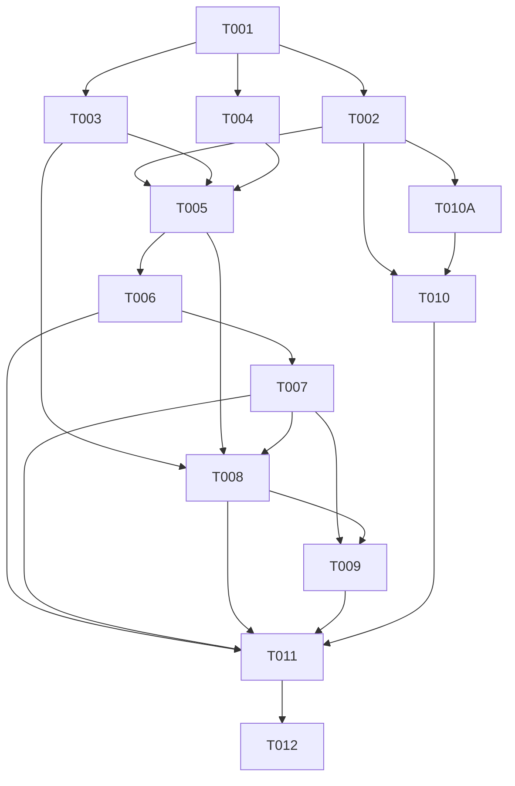

# Ex-Lend 项目重构企划书

> 扫描日期：2026-08-23  |  扫描模式：只读静态审计 + typecheck/build 基线
> 项目：`new-ui` / `ex-lend-web` 0.1.0
> 目标执行模型：DeepSeek V4 Flash；HIGH/CRITICAL 任务由 5.6 Sol 复审

## 1. Executive Summary

项目当前可构建、可类型检查，核心业务已经覆盖登录、收银、订单、审核、财务、工资、客户/员工/商品与 Supabase 持久化。整体判断：值得进行**中等规模、渐进式重构**，不建议重写。

主要问题不是当前无法运行，而是边界逐渐失真：页面既负责 UI、状态、数据加载和部分写库；`lib/supabase-api.ts` 集中约 641 行读写；`useResource` 被 19 个入口共享；认证、Mock、缓存、local/sessionStorage 交叉影响数据源；SQL 同时存在模块文件、迁移补丁和 `ALL_IN_ONE.sql` 三套维护面。最大风险是资金、提成、钱包流水和权限行为在重构中被意外改变。只读 SQL 审计还发现线上权限状态必须单独核实：仓库脚本存在历史旧版函数和宽泛 `FOR ALL` 策略，不能仅凭源码确认线上已闭环。

建议强度：先建立测试/基线，再做低风险数据访问边界与状态契约，之后按业务域拆分；数据库 schema、RPC、RLS、Storage 路径和公共数据形状列为 RED ZONE。预计首轮涉及 10–18 个新增/调整文件，后续按业务域分批，不做 Big Bang Rewrite。

## 2. Project Overview

| 项目 | 已确认事实 |
|---|---|
| 类型 | Next.js App Router 单仓前端 + Supabase 后端脚本 |
| 语言 | TypeScript/TSX 62 文件，SQL 26 文件，CSS 1 文件（图谱） |
| 框架 | Next.js 15.5.22、React 19、Tailwind CSS 4 |
| 数据系统 | Supabase PostgREST、Auth、Storage、RPC；Realtime 仅在业务文档中声明，代码中未确认订阅 |
| 入口 | `app/layout.tsx`、`app/login/page.tsx`、`app/(shell)/layout.tsx` 与 20 个业务页面 |
| 构建 | npm；`next build`；`tsc --noEmit` |
| 测试 | UNKNOWN：未发现 test/e2e 配置或测试目录；package scripts 只有 dev/build/start/typecheck |
| 部署 | `npm run start`；`start-prod.ps1`；环境变量为 `NEXT_PUBLIC_SUPABASE_URL`、`NEXT_PUBLIC_SUPABASE_ANON_KEY`、Mock 开关 |
| 规模 | 1,094 图谱节点、2,220 条边；入口页面 20 个；最大前端文件为登录页 1,002 行、CSS 769 行、订单详情组件 653 行、API 层 641 行 |

## 3. Current Architecture

实际架构不是严格分层，而是页面/业务组件直接消费 Hook、Mock 类型和 Supabase API；少数页面还直接 import `supabase` 写表或访问 Storage。

```text
RootLayout
 └─ SkinProvider → AuthProvider → DataProvider → BootProvider → ProfileProvider
     └─ ShellLayout
         └─ RequireAuth → PrefetchAll → AppShell → Page
             ├─ useAuth / useResource / useRealData
             ├─ UI components + business components
             ├─ lib/supabase-api.ts (集中查询/RPC/Storage)
             └─ 少数 Page/Component → lib/supabase.ts → Supabase

Supabase Auth/PostgREST/RPC/Storage
 └─ SQL schema/rls/triggers/business modules
     └─ ALL_IN_ONE.sql + migration/patch files（多份源文件）
```

主要模块：

- `app/(shell)`: 页面编排、表单、筛选、局部状态、部分直接数据写入。
- `components/ui`: 基础视觉组件，`Button` fan-in 28、`Input` 19、`Panel` 19、`PageHeader` 19。
- `components/business`: 订单/收银/小票等复合业务组件；`OrderDetailModal` 647 行。
- `lib/data-store.tsx`: 全局 Registry、`ensure`、`mutate`、dirty 标记、刷新。
- `lib/auth.tsx`: Supabase session、users 表角色、JWT fallback、Mock login、localStorage。
- `lib/supabase-api.ts`: 数据映射、表查询、RPC、Storage 上传。
- `sql/` 与 `ALL_IN_ONE.sql`: 数据库定义、RLS、触发器、RPC、增量修复。

## 4. Runtime / Data Flow

### 启动与认证

`RootLayout` 创建 Provider 链；`AuthProvider` 调 `supabase.auth.getSession()` 并监听 `onAuthStateChange`，再查询 `users.role`，最后才回退 JWT role 或允许的 Mock role。`RequireAuth` 控制 `/login` 与 shell 路由，`PrefetchAll` 预取高频资源并受 10 秒安全定时器保护。

### 读数据

```text
Page → useResource(key, fetcher, mockFallback)
     → useAuth 判断真实 session / mock
     → ensure → lib/supabase-api.apiXxx
     → supabase.from(...).select / supabase.rpc
     → 字段映射为 lib/mock-data.ts 类型
     → Registry + 页面消费
```

`useResource` 的调用者包含订单、收银、客户、员工、商品、财务、审核、设置等 19 个入口。`useRealData` 是第二套直取式数据通道，真实会话失败时置空，不回退 Mock。

### 核心资金流

```text
CashierPage.doSubmit
 → rpcCreateOrderMulti
 → supabase.rpc("create_order_multi")
 → order / order_item / wallet pending（数据库权威算价）
 → batch_start / batch_complete
 → Audit: set_pending_order_commissions → approve_commission
 → employee wallet + customer pending 消费 + ledger
 → payout_salary → payout / payout_detail / wallet_ledger
```

### 写数据

推荐路径是页面 → `supabase-api` → RPC；已确认例外包括 `customers/page.tsx`、`cashier/page.tsx`、`categories/page.tsx`、`todos/page.tsx`、`notes/page.tsx`、`employees/page.tsx`、`products/page.tsx`、`rules/page.tsx`、`settings/page.tsx` 等直接使用 `supabase.from` 或 Storage。

## 5. Dependency Analysis

### 已确认高耦合

- `(shell)` → `ui` 121 次调用、→ `business` 28 次、→ `data-store` 23 次、→ `auth` 14 次。
- `useResource` fan-in 19，`useAuth` fan-in 25；二者是全局变更放大器。
- `lib/supabase-api.ts` 同时承担 transport、字段映射、兼容旧 schema、RPC 参数构造和 Storage 操作。
- `business` → `ui` 12 次是合理方向；反向 UI → 业务未发现。业务页面直接 → `supabase` 是边界泄漏。

### 循环依赖结论

图谱的宽松路径查询返回大量“自身可回到自身”的调用路径，其中包含递归/重复路径，不能直接证明真实模块循环。当前**UNKNOWN：是否存在模块级 IMPORT cycle**；必须在 TASK-002 通过静态 import-cycle 工具或明确图查询验证后再决定是否处理。不要把这些结果直接写成 P0。

### 重复与相似

- SQL：`is_boss`、`is_manager`、`recharge_wallet` 等在 `ALL_IN_ONE.sql`、`sql/rls.sql`、`sql/p0_security_fixes.sql` 等多份出现；这是发布一致性风险，不是简单代码重复。
- `money` 格式化函数在多个页面和 `OrderDetailModal` 重复。
- `apiAnnouncements` 与 `apiNotes`、若干规则查询相似；仅在确认返回契约完全一致后抽象。
- `OrderStatusTag` 与 `AuditStatusTag` 相似但语义不同，暂不合并。

## 6. Technical Debt Report

### P0

1. **线上数据库权限/函数版本未核实，可能保留任意认证用户充值路径。** `sql/customer.sql` 存在早期 `recharge_wallet`，`sql/p0_security_fixes.sql` 才加入角色校验；若线上未按正确顺序执行补丁，任意 authenticated 用户可能修改客户余额。必须只读检查当前 `pg_proc` 定义、`proacl` 与 `pg_policies`，不能把仓库脚本当成线上事实。
2. **财务表存在宽泛 staff 直写策略的证据。** `sql/rls.sql` 对 `customer`、`order`、`order_member`、`customer_wallet_ledger` 定义 `FOR ALL` 写策略；`lib/supabase-api.ts:updateOrderStatus()` 也直接更新订单。账本、余额、订单金额和审核字段若可被 REST 直写，会绕过 RPC 状态机。线上是否已收紧为 UNKNOWN，必须单独核验。
3. **SECURITY DEFINER 函数的 search_path 与授权面需要核验。** `sql/system.sql` 的 `update_self_avatar`、`update_self_profile` 等函数缺少统一 `SET search_path = public` 证据；需检查线上函数配置与 EXECUTE ACL。

现有安全修复记录显示历史上还存在 Storage 路径和默认 EXECUTE 风险，故 `sql/p0_security_fixes.sql`、`sql/rls.sql`、README 的 P0 修复记录均属于 RED ZONE 证据。

### P1

1. 数据访问边界泄漏：多个页面绕过 `supabase-api` 直连表/Storage，导致权限、错误和映射策略分散。证据：上述直接 import 清单。
2. 共享状态高风险：`useResource` 的 Registry、dirty、ensure、后台刷新影响 19 个页面；行为缺乏自动化测试。
3. 巨型业务单元：`OrderDetailModal` 647 行、`ReceiptEditor` 392 行、`CashierPage` 536 行、`OrdersPage` 376 行、`LoginPage` 1,002 行；多个 UI、状态、副作用和业务判断混在一起。
4. SQL 发布源分裂：模块 SQL、增量补丁、`ALL_IN_ONE.sql` 并存，图谱发现 32 组相似关系；漂移检查脚本存在但未纳入 npm/CI 验证。
5. 测试安全网缺失：无 unit/integration/e2e 配置，资金流、权限与 dirty 语义无法在重构前锁定。

### P2

- `lib/supabase-api.ts` 过宽，查询/写入/Storage/映射没有按业务域分组。
- `localStorage`、`sessionStorage`、内存 Registry、Mock fallback 形成多种状态来源。
- 错误处理返回风格不一致：许多 API 只检查 `data`，忽略并保留 Supabase `error`；页面又各自 toast/console。
- 规则、分类、笔记、公告等页面仍有相似的表单写库逻辑。

### P3

- 页面内 `money`、图片加载、toast 定时器等小工具重复。
- 登录页将大段 CSS 与行为同置，影响可读性但不是当前功能阻断。
- package scripts 没有 lint 命令，命名/格式只能依赖 typecheck/build 间接覆盖。

## 7. Code Smell Report

| Smell | 证据 | 影响 |
|---|---|---|
| God component | `OrderDetailModal.OrderDetailModal` 647 行，复杂度 38、认知复杂度 53 | 订单状态、凭证、提成、改价、小票等改动互相影响 |
| God page | `LoginPage` 1,002 行，复杂度 52、认知复杂度 95 | 视觉动画与认证提交难以单独测试 |
| God data module | `lib/supabase-api.ts` 641 行 | transport、mapping、compatibility、Storage 混合 |
| Dual data path | `useResource` + `useRealData` + Mock | 同一资源可能有不同加载/失败语义 |
| Direct infrastructure access | 多个页面 import `supabase` | 页面知道表名、列名、Storage bucket，边界泄漏 |
| Hidden side effects | `useResource` 的全局 Registry/dirty/refresh | 调用者必须理解跨页面生命周期 |
| Source duplication | SQL 模块 + patch + ALL_IN_ONE | 修复后可能只更新一份，线上/重建库不一致 |

## 8. Risk Zones

### REFACTOR RED ZONE

- `sql/schema.sql`、`sql/rls.sql`、`sql/order.sql`、`sql/commission.sql`、`sql/refund.sql`、`ALL_IN_ONE.sql`：改变会影响表结构、资金状态机、RLS 与重建库；任何修改必须数据库副本验证和人工复审。
- `create_order_multi`、`approve_commission`、`payout_salary`、`refund_order`、`delete_order`、`adjust_order_price`：核心资金与不可变流水；必须保持金额、舍入、状态转移和幂等行为。
- `sql/rls.sql` 的 `FOR ALL` staff policies、`sql/customer.sql` 的旧 `recharge_wallet`、`sql/system.sql` 的 SECURITY DEFINER 函数：线上状态未知，禁止凭仓库文本推断已安全；必须先做只读权限核查。
- `lib/auth.tsx`、`RequireAuth`、`RequireRole`、`sql/p0_security_fixes.sql`：认证和权限；不能将 Mock role、JWT claim、users 表角色混用为新行为。
- `lib/mock-data.ts`、`useResource`、`useRealData`：公共数据形状和失败语义；页面广泛依赖。
- Storage bucket/path：`avatars`、`payment-proofs` 及 `is_proof_path_valid`；路径格式变化会导致历史凭证不可读。

## 9. Test Coverage & Safety Net

已确认：`npm run typecheck` 通过；`npm run build` 通过；构建产出 22 个路由。未发现 test/e2e/fixture/mock 配置，未发现 lint script。所有“无测试”均记录为基线事实，不等于运行时无 bug。

必须先补的保护：

1. `useResource`：ensure 去重、dirty 不被刷新覆盖、invalidate/refresh 行为、真实请求失败不回退 Mock。
2. `auth`：session、users role、JWT fallback、Mock 开关和 signOut。
3. 订单 payload：`CashierPage.doSubmit` 到 `rpcCreateOrderMulti` 的参数形状与金额精度。
4. 纯映射函数：Supabase row → `mock-data` 类型，至少覆盖 null、旧列兼容和状态枚举。
5. SQL：在 Supabase staging/副本执行核心 RPC/RLS 回归，不把线上生产库当测试环境。

## 10. Target Architecture

```text
Page / route
 └─ Feature hook + view model（只处理交互和展示状态）
     └─ Feature service（订单/客户/员工/规则/财务）
         └─ Repository / Supabase adapter（唯一基础设施入口）
             └─ Supabase tables / RPC / Storage

Shared contracts: domain types + mappers + Result/Error contract
Cross-cutting: auth policy, cache/query lifecycle, logging
SQL source of truth: canonical modules → generated ALL_IN_ONE → drift check
```

CURRENT → TARGET 的理由：保留现有页面和 RPC 合同，只将基础设施访问从页面移入 feature service/repository；保留 `useResource` 的兼容 facade，先增加契约测试再逐步替换；SQL 不重写业务，只明确 canonical source 与生成/漂移验证。

## 11. Refactor Strategy

采用 Behavior-Preserving、绞杀式迁移：先建立基线和契约，先收拢直接 Supabase 访问，再拆页面内部纯逻辑，最后才考虑缓存/状态模型。每个 TASK 只处理一个边界；发现 bug 单列 BUG，不混进重构。任何 DB/RLS/RPC 行为变化都标记为 `Executor: 5.6 Sol Review Required`。

## 12. Refactor Stages

- Stage 0：基线、测试工具、cycle/drift 检查、文档和 checkpoint。
- Stage 1：统一错误/结果契约；为 API mapping 和 `useResource` 增加测试。
- Stage 2：按 feature 拆 `supabase-api`，先迁移只读查询，保留旧导出 facade。
- Stage 3：收拢页面直连 Supabase/Storage；优先低风险 notes/announcements/categories，再处理订单/凭证。
- Stage 4：拆 `CashierPage`、`OrderDetailModal`、`ReceiptEditor` 的纯函数与视图模型，不改变 UI/参数。
- Stage 5：明确 SQL canonical source、生成/漂移检查；不改 RPC 语义。
- Stage 6：在有数据证据时处理重复请求、预取和 bundle；不先做性能猜测。
- Stage 7：全量回归、人工 smoke、复审和最终清理。

## 13. Detailed Task List

### TASK-001

标题：锁定可重复的工程基线与安全网

优先级：P1  | Risk: MEDIUM  | Executor: DeepSeek V4 Flash

目标：在不改变业务代码行为的前提下补齐 lint/test 入口和最小测试框架。

问题描述：package.json 只有 dev/build/start/typecheck；没有 test/lint/e2e。

问题证据：`package.json` scripts；全仓未发现测试目录。

需要修改：`package.json`、测试配置文件、允许新建 `tests/`；禁止修改 `app/`、`lib/`、`sql/`。

具体操作步骤：

1. 选择与现有 TypeScript/React 兼容的最小 unit 测试方案，记录版本，不升级无关依赖。
2. 添加 lint/test 命令和 CI 可调用的 typecheck/build 命令。
3. 先添加一个无副作用 smoke test，确认命令可运行。

修改前行为：只有 typecheck/build 可验证。修改后行为：新增可重复 test/lint 命令。

必须保持不变：生产 bundle、路由、Supabase 调用和环境变量语义。

验证方式：`npm run typecheck`、`npm run build`、新增 `npm test`、新增 lint 命令。

成功标准：四项命令成功；失败立即停止。回滚：只回滚本 TASK 文件和依赖变更。依赖任务：无。后续任务：TASK-002。

### TASK-002

标题：建立 import cycle、SQL drift 与源码清单检查

优先级：P1  | Risk: LOW  | Executor: DeepSeek V4 Flash

目标：把当前 UNKNOWN 的模块循环和 SQL 多源漂移变成可重复报告。

问题证据：图谱宽松 cycle 查询返回自回路径；`ALL_IN_ONE.sql` 与 `sql/` 存在相似函数；已有 `scripts/check-sql-drift.ps1` 但不在 package scripts。

涉及文件：`package.json`、`scripts/check-sql-drift.ps1`；允许新建 `scripts/check-import-cycles.*` 与报告输出目录。禁止改 SQL 内容。

步骤：运行现有 drift 脚本；加入明确的 import-cycle 检查；输出文件/符号/退出码；将结果纳入 CI 或手工验证。

修改前/后：前者只能人工或图谱查看，后者能在每个 checkpoint 复跑。接口/数据兼容：无。风险：工具误报；成功标准是误报规则有文档且脚本可重复。依赖：TASK-001；后续：TASK-003、TASK-005。

### TASK-003

标题：为 `lib/data-store.tsx` 建立行为契约测试

优先级：P1  | Risk: HIGH  | Executor: 5.6 Sol Review Required

目标：锁定 `DataProvider`、`useResource`、`ensure`、`mutate`、`invalidate`、`refreshAll` 的现有语义。

问题证据：`lib/data-store.tsx` 约 198 行；`useResource` 被 19 个页面调用；全仓无测试。

涉及文件：允许新建 `tests/data-store.*`；必要时只修改测试可见性，不重写实现。禁止改变 Mock fallback、dirty 和 refresh 逻辑。

步骤：测试同 key 请求去重；测试 dirty 数据不被后台结果覆盖；测试真实请求失败与 Mock fallback；测试 invalidate/refresh；测试 unmount 不产生状态更新。

成功标准：测试覆盖上述行为且当前实现通过；失败判断：任一语义不同立即停止。回滚：删除新增测试。依赖：TASK-001；后续：TASK-006、TASK-008。

### TASK-004

标题：为 `lib/auth.tsx` 建立认证与角色契约测试

优先级：P1  | Risk: CRITICAL  | Executor: 5.6 Sol Review Required

目标：固定真实 session、users.role、JWT fallback、Mock 开关和 signOut 的现有优先级。

证据：`AuthProvider` 同时调用 `getSession`、`onAuthStateChange`、users 表和 localStorage；`useAuth` fan-in 25。

涉及文件：允许新建 `tests/auth.*` 和 Supabase mock；禁止修改认证实现、SQL RLS、token 结构和生产环境变量。

步骤：覆盖无 session、真实 session 有/无 users role、Mock 开关关闭、signOut、auth listener cleanup；记录期望矩阵。

成功标准：矩阵测试通过并由高级模型复审。依赖：TASK-001；后续：TASK-008、TASK-009。

### TASK-005

标题：将 `lib/supabase-api.ts` 拆为只读 feature adapters，保留兼容导出

优先级：P1  | Risk: HIGH  | Executor: 5.6 Sol Review Required

目标：按 customers/products/orders/finance/profile/storage 拆分 transport 与 mapper，先不改变导出名和返回形状。

证据：`lib/supabase-api.ts` 641 行，包含查询、RPC、Storage、旧列兼容和映射。

涉及文件：`lib/supabase-api.ts`；允许新建 `lib/features/*`、`lib/mappers/*`；禁止改 Supabase 表名、RPC 名、参数、返回类型和页面。

步骤：建立每个 adapter；迁移一个 feature 的只读函数；旧文件 re-export；跑 mapping/API 契约；按 feature 提交 checkpoint。

成功标准：typecheck/build/测试通过，导出 diff 只有内部路径变化。回滚：恢复旧文件。依赖：TASK-002、003、004；后续：TASK-006、007。

### TASK-006

标题：收拢低风险页面的直接 Supabase 写入

优先级：P1  | Risk: MEDIUM  | Executor: DeepSeek V4 Flash

目标：迁移 notes、announcements、categories、todos 等页面的直连写入到对应 feature adapter。

证据：`app/(shell)/notes/page.tsx`、`announcements/page.tsx`、`categories/page.tsx`、`todos/page.tsx` 直接 import `supabase`。

步骤：为每个写入建立单一 adapter；保持 optimistic insert、失败回滚、toast 文案；删除页面基础设施 import；按页面单独验证。

禁止行为：不迁移订单/钱包/凭证；不改表结构、RLS、返回值、UI。成功标准：页面行为与 typecheck/build 一致。依赖：TASK-005；后续：TASK-007。

### TASK-007

标题：收拢高风险订单/Storage 直连访问

优先级：P1  | Risk: CRITICAL  | Executor: 5.6 Sol Review Required

目标：迁移 cashier、OrderDetailModal、products、settings、payouts 等剩余直连访问，同时保持 RPC/Storage contract。

证据：`cashier/page.tsx`、`OrderDetailModal.tsx`、`settings/page.tsx` 等直接 import `supabase`；凭证路径由 `is_proof_path_valid` 约束。

步骤：先补订单 payload/Storage contract；为每个调用新增 adapter；逐一迁移并做真实接口 mock；最后删除直连 import。

禁止行为：不改 RPC SQL、不改 bucket/path、不改变权限、不改变订单金额或状态。成功标准：contract、typecheck、build、人工 smoke 通过。依赖：TASK-003、004、005、006；后续：TASK-010。

### TASK-008

标题：拆分 `CashierPage` 的纯业务计算与视图

优先级：P1  | Risk: HIGH  | Executor: 5.6 Sol Review Required

目标：把 `resolveVipRate`、`resolveProduct`、`add`、`setQty`、`fmtPaid`、`doSubmit` 的纯逻辑和 view model 分开，不改变下单 payload。

证据：`app/(shell)/cashier/page.tsx` 536 行；调用链 `doSubmit → rpcCreateOrderMulti → supabase.rpc`。

步骤：先为纯函数建立输入输出测试；移动纯函数；保留页面状态和 UI；最后通过 payload snapshot 验证。

禁止行为：不改 VIP 规则优先级、金额舍入、员工 0/1/2 人约束、RPC 名或 UI。依赖：TASK-003、005、007；后续：TASK-009。

### TASK-009

标题：拆分 `OrderDetailModal` 与 `ReceiptEditor`

优先级：P1  | Risk: HIGH  | Executor: 5.6 Sol Review Required

目标：分离订单状态/凭证/提成操作与小票渲染导出，保持文件输出和状态行为。

证据：`components/business/OrderDetailModal.tsx` 653 行；`ReceiptEditor.tsx` 392 行，含上传、Storage、canvas、PNG/JPEG/PDF 导出。

步骤：提取无副作用 mapper/formatters；提取 receipt export adapter；保留现有 props；增加 PNG/JPEG/PDF 与凭证 path 回归。

禁止行为：不改变纸张尺寸、像素比、文件名、Storage bucket、订单状态。依赖：TASK-007、008；后续：TASK-010。

### TASK-010

标题：确立 SQL canonical source 与自动生成/漂移门禁

优先级：P1  | Risk: CRITICAL  | Executor: 5.6 Sol Review Required

目标：明确模块 SQL 为人工维护源，`ALL_IN_ONE.sql` 为生成/发布产物，避免重复函数只改一份。

证据：`ALL_IN_ONE.sql` 与 `sql/*.sql` 存在 `is_boss`、`gen_order_no`、`recharge_wallet` 等重复；历史补丁多。

步骤：先比较并记录差异；选定不破坏现有发布流程的 canonical 规则；完善 drift 脚本；仅在内容一致后调整文档/生成流程。

禁止行为：不重写 RPC、不改 RLS/schema、不自动执行线上 SQL、不删除历史迁移。成功标准：全量 drift 清晰、重建脚本可审查、数据库副本回归通过。依赖：TASK-002；后续：TASK-011。

### TASK-010A

标题：只读核验线上 Supabase 的 RLS、RPC ACL 与 SECURITY DEFINER 状态

优先级：P0  | Risk: CRITICAL  | Executor: 5.6 Sol Review Required

目标：确认线上数据库是否已经应用 `p0_security_fixes.sql`，并证明 manager/staff 无法直接改写余额、账本、订单金额和审核字段。

问题证据：`sql/customer.sql` 有旧版 `recharge_wallet`；`sql/p0_security_fixes.sql` 才加入权限校验；`sql/rls.sql` 有 customer/order/order_member/customer_wallet_ledger 的 `FOR ALL` 策略；`sql/system.sql` 的 SECURITY DEFINER 函数缺少统一 search_path 证据。

需要修改：本 TASK 默认**不修改仓库 SQL、不执行线上写操作**。允许新建只读核验 SQL/报告，例如 `sql/audit_live_permissions.sql`；禁止修改 schema、RPC、RLS、ACL、数据。

具体操作步骤：

1. 在有授权的 Supabase SQL Editor 只读查询 `pg_proc` 当前函数定义、`prosecdef`、`proconfig`、`proacl`，以及 `pg_policies`、表 grants、`has_function_privilege`。
2. 按 anonymous、manager、boss、disabled user 建立权限矩阵；重点测试 recharge、订单金额、余额、账本、审核、Storage proof。
3. 将每个差异标记为 LIVE CONFIRMED / REPOSITORY ONLY / UNKNOWN；若发现可利用权限，立即停止后续重构并升级安全修复任务。

修改前行为：线上安全状态未被仓库证据证明。修改后行为：得到可审计的只读核验结果；业务行为保持不变。

禁止行为：不执行 UPDATE/INSERT/DELETE/ALTER/CREATE OR REPLACE；不直接运行补丁；不以客户端 RequireAuth 作为数据库安全证明。

验证方式：只读 SQL 结果、权限矩阵、函数定义对比、Storage policy 检查。成功标准：所有 P0 项有 LIVE CONFIRMED 或明确阻塞原因；失败判断：任一匿名/manager 可绕过资金约束则停止并报告。回滚方式：无数据变更，无需回滚。依赖任务：TASK-002；后续任务：TASK-010、TASK-011。

### TASK-011

标题：最终删除兼容 facade 与确认无用代码

优先级：P2  | Risk: MEDIUM  | Executor: 5.6 Sol Review Required

目标：仅删除已有迁移完成且有调用图/测试证据的旧导出、重复 helper 和无用兼容层。

证据：TASK-005~010 的调用图、测试和 drift 报告。

步骤：逐项列出候选；确认 fan-in=0 且无动态引用；一次删除一个小批次；运行完整验证和 smoke。

禁止行为：不按目录美化、不删除未知 SQL/公共导出、不升级依赖。成功标准：无新增 P1/P0、所有 checkpoint 通过。依赖：TASK-006~010A；后续：TASK-012。

### TASK-012

标题：最终回归与交付审查

优先级：P1  | Risk: HIGH  | Executor: 5.6 Sol Review Required

目标：证明重构保持行为并完成文档/索引交付。

步骤：运行 typecheck、lint、unit、build、SQL drift；执行登录、角色、收银、订单状态、审核、充值、退款、工资、凭证、设置 smoke；核对 Git diff 与任务范围；更新 README/报告。

成功标准：所有自动验证通过，关键业务人工通过，高风险任务有复审记录；失败立即停止并回滚到最近 checkpoint。依赖：TASK-011。

## 14. Task Dependency Graph



## 15. Parallel Execution Plan

可并行：TASK-002、TASK-003、TASK-004（均依赖 TASK-001）；TASK-006 与 TASK-010 可在 TASK-005/002 后并行；TASK-008 与 TASK-009 只有在各自前置契约完成后可并行。

必须串行：TASK-001 → TASK-005 → TASK-006 → TASK-007；TASK-002 → TASK-010A → TASK-010；TASK-007 必须先于高风险页面拆分；TASK-011、TASK-012 必须最后执行。数据库/权限任务不得与订单行为任务并行合并。

## 16. Checkpoints

- CP-01（Stage 0）：typecheck/build/lint/test 可运行；cycle/drift 报告可生成。
- CP-02（契约）：data-store/auth/API mapping/订单 payload 测试通过。
- CP-03（边界）：低风险页面不再直连 Supabase，typecheck/build 通过。
- CP-04（高风险）：订单/Storage 迁移完成，真实接口 mock + 人工 smoke 通过，等待高级复审。
- CP-05（SQL）：canonical/drift 方案确认，未改变 RPC/RLS 语义。
- CP-06（交付）：完整验证、Git diff 审查、文档和日志更新。

每个 checkpoint 都必须建立 Git commit；未通过不得进入下一个阶段。

## 17. Validation Plan

自动验证：`npm run typecheck`、`npm run lint`、`npm test`、`npm run build`、`scripts/check-sql-drift.ps1`、import-cycle 检查。当前 lint/test 命令为待 TASK-001 建立，不能把 UNKNOWN 当成通过。

人工 smoke：Mock 登录 boss/manager；真实登录；角色菜单；收银现金/钱包/VIP/0-2 员工；订单 booking→in_progress→completed→approved/rejected；充值、退款、删单、改价；财务双口径；工资结算与凭证；头像/Logo/小票三种导出；刷新与失败回滚。

## 18. Rollback Plan

每个 TASK 单独提交，失败恢复到上一个 checkpoint commit；禁止 force push、reset --hard 或删除用户已有改动。页面迁移失败时保留旧 facade；API 拆分失败时恢复旧 re-export；SQL 任务失败时不执行线上变更，使用数据库副本/备份恢复。任何数据修复必须独立迁移并先做预检查询。

## 19. Final Acceptance Criteria

- `typecheck`、lint、unit、build、drift、cycle 检查全部通过。
- 登录/角色/资金核心流程的契约与人工 smoke 通过。
- 页面不再直接访问基础设施，或每个保留例外有书面理由。
- `useResource` 与 auth 的现有语义有自动化测试保护。
- `supabase-api` 按 feature 拆分且旧公共导出在迁移期间兼容。
- SQL canonical source、`ALL_IN_ONE.sql` 与 drift 流程清晰；未引入未经复审的 schema/RPC/RLS 行为变化。
- 无新增 P0/P1；所有删除项有调用图和测试证据。

## 20. DeepSeek V4 Flash 执行说明

1. 严格按 DAG 与 TASK 顺序执行，一次只执行一个 TASK。
2. 先读 TASK 的文件、符号、约束和成功标准，不自行重新设计架构。
3. 禁止修改 TASK 范围外代码；发现问题新建候选任务，不顺手处理。
4. 每个 TASK 只提交必要文件，并运行该 TASK 指定验证。
5. 验证失败立即停止，报告第一处失败、命令、文件和回滚点。
6. 不改变 DB schema、RPC、RLS、Storage contract、公共返回值或 UI 行为，除非 TASK 明确允许。
7. HIGH/CRITICAL 任务完成后等待 5.6 Sol 复审，不继续执行后续任务。
8. 不在失败状态下进入下一个 TASK；每个 checkpoint 建立 Git commit。

## TASK EXECUTION INDEX

| Order | Task | Risk | Executor | Dependencies | Files | Verification |
|---:|---|---|---|---|---|---|
| 1 | TASK-001 基线安全网 | MEDIUM | Flash | — | package/tests | typecheck/lint/test/build |
| 2 | TASK-002 cycle/drift 门禁 | LOW | Flash | 001 | scripts/package | cycle + drift |
| 3 | TASK-003 data-store 契约 | HIGH | Sol review | 001 | tests/data-store | unit + typecheck |
| 4 | TASK-004 auth 契约 | CRITICAL | Sol review | 001 | tests/auth | unit + role matrix |
| 5 | TASK-005 feature adapters | HIGH | Sol review | 002/003/004 | lib/features, supabase-api | unit/typecheck/build |
| 6 | TASK-006 低风险直连迁移 | MEDIUM | Flash | 005 | notes/announcements/categories/todos | unit/build/smoke |
| 7 | TASK-007 订单/Storage 迁移 | CRITICAL | Sol review | 003/004/005/006 | cashier/order/settings/etc. | contract/build/smoke |
| 8 | TASK-008 Cashier 拆分 | HIGH | Sol review | 003/005/007 | cashier + tests | payload regression |
| 9 | TASK-009 订单详情/小票拆分 | HIGH | Sol review | 007/008 | business components | export/storage smoke |
| 10 | TASK-010 SQL canonical/drift | CRITICAL | Sol review | 002/010A | sql/scripts/docs | drift + DB copy |
| 11 | TASK-010A 线上权限只读核验 | CRITICAL | Sol review | 002 | audit SQL/report | pg_proc/policies/ACL matrix |
| 12 | TASK-011 清理 facade | MEDIUM | Sol review | 006–010A | approved files | full regression |
| 13 | TASK-012 最终验收 | HIGH | Sol review | 011 | docs/logs | complete validation |

## 扫描结论

项目不是“不值得重构”，也不是需要重写的状态。最合理路径是**中等规模渐进式重构**：先为已有可运行行为建立证据，再收拢基础设施边界，最后拆解高风险页面和 SQL 发布流程。任何缺少证据的“架构美化”都不进入任务清单。
