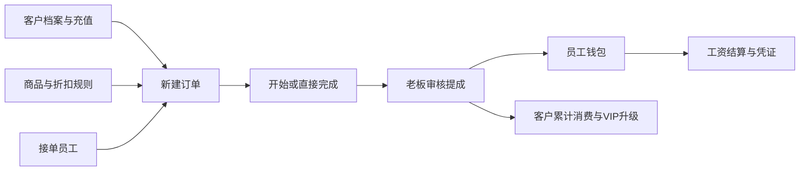

# 系统功能全景（2026-10-10）

这是一套围绕客户、服务商品、接单员工和提成结算运行的内部经营后台。核心流程是：客户下单 → 员工提供服务 → 标记完成 → 老板审核提成 → 员工钱包入账 → 工资结算。

## 1. 梳理范围与证据

- 范围：当前 Web 系统，18 个导航入口，另有登录页与独立订单详情页。
- 代码基线：`f15fc7bf37a235c3d954be49254d1641478f7174`；本次只补功能文档，不修改业务逻辑或线上数据。
- 2026-10-10 只读核对：正式域名仍指向上述版本；当前数据库有 25 张 public 表，22 个可由登录用户执行的业务 RPC，另有 3 个角色判断函数。这些函数均不开放给匿名用户。
- 本文区分：**已有业务入口**、**历史数据受限**、**仅有按钮/结构或待专项验收**。页面存在、接口有权限、自动测试通过和真实浏览器逐项验收是不同证据。
- 依据：现有页面与调用代码、运行中的数据库函数/RLS、10 月 7–8 日恢复与验证记录。旧接口说明中的 37 个函数、旧权限和旧 @ 通知说明不直接当成现状。

## 2. 业务关系

**三个动作不能混为一谈：**“完成”改变服务进度；“审核”才结转待结金额、计算提成并记入员工钱包；“工资结算”再扣减员工钱包并生成发放批次。系统中的现金、充值和工资发放是业务记账，当前代码没有接入银行卡或第三方支付渠道自动转账。

## 3. 功能清单

| 模块/入口 | 当前可以做什么 | 主要边界 |
|---|---|---|
| 登录 `/login` | 邮箱密码登录、校验输入、展示错误；未登录访问后台会跳转登录；侧栏退出登录 | 后台角色为老板、管理员；未发现站内注册、找回密码或账号管理页面 |
| 工作台 `/` | 今日订单、今日实付合计、在职员工、最近订单；本人创建订单按日期/状态筛选；快捷导航 | 老板显示待审核提成，管理员显示进行中订单；实付合计排除取消单，但并非仅统计已审核单 |
| 新建订单 `/cashier` | 选择/搜索客户或现场新建客户；常用 Top12/全部在售商品；分类/关键词筛选；多商品和数量；选择接单员工；现金/钱包支付；VIP 折扣；手动填写实付；成功后出小票 | 可先选 0/1/2 名员工，开始/完成前须至少 1 人；服务器限制每单最多 50 种商品；实付须在 0 与原价之间；未知提交结果要求先核对 |
| 订单 `/orders` | 按订单号、客户、日期、服务状态、审核状态、支付方式、实付范围和员工筛选；员工支持“任一/同时参与”；按时间/金额/佣金排序；导出当前筛选 CSV；勾选批量开始/完成/审核 | 批量最多 200 个 ID；状态批量显示实际更新、未变更与原因；财务批量仍受旧单保护 |
| 订单详情 `/orders/[id]` 与详情弹窗 | 查看客户、原价/实付/折扣、商品、员工、提成及凭证；开始、完成、编辑/更正、改价、提成覆盖、撤销审核、退款、删除；生成小票 | 两个入口按钮不同，具体权限见下一节；操作必须满足订单状态与数据完整性要求 |
| 审核台 `/audit` | 查看已完成、有员工的待审核订单；单笔/显式勾选批量审核；提成覆盖；已审核单撤销审核后回到待审核 | 老板入口；批量默认不选任何订单，不会自动把全部旧待审单送审 |
| 客户 `/customers` | 姓名/手机号搜索；新建普通/VIP 客户；查看本金、赠金、待结、累计消费与状态；套餐/自定义充值；客户流水 | 现有页面未提供完整客户资料编辑、删除、停用切换或手工指定任意 VIP 等级的流程；新建 VIP 从初始等级开始 |
| 员工 `/employees` | 搜索、新建；查看昵称、真实姓名、等级、在职/离职、工资余额、欠款；编辑真实姓名、收款账号、等级及状态；查看佣金/发放/调整与关联订单流水 | 员工档案不是登录账号；“批量导入”当前只是打开新建员工弹窗，没有真正导入流程 |
| 商品 `/products` | 搜索、分类及上下架筛选；新建名称/分类/价格/提成类型；行内上架/下架；老板隐藏商品 | 当前没有完整的既有商品名称/价格编辑界面；订单改价是另一项功能；不包含库存、采购或供应商管理 |
| 已隐藏商品 `/products/hidden` | 查看隐藏时间、搜索、恢复商品 | 老板导航入口；隐藏属于软删除，不是抹掉历史订单 |
| 商品分类 `/categories` | 新建分类、说明、查看状态、启用/停用 | 普通业务资料维护入口；不能据此声称已有分类删除或批量迁移功能 |
| 规则配置 `/rules` | 新增员工等级提成规则、保存既有等级比例；新增 VIP 分类折扣、升级门槛、充值套餐；套餐启停 | 老板入口；VIP 折扣/升级门槛目前主要提供新增和展示，未形成统一的修改/删除界面 |
| 财务 `/finance` | 日期范围营业额、折扣、取消单数、充值本金；今日提成、已审核毛利、待结、客户余额、员工余额；近 7 日毛利；客户/员工流水、工资批次、删除审计；另有工资发放弹窗 | 菜单仅老板显示；页面代码保留管理员只读描述，实际只能读各表授权范围，工资批次与删除审计受老板 RLS 限制；统计口径见第 6 节 |
| 工资结算 `/payroll` | 按工资结余排列员工；累计佣金、已发放、调整/扣减、余额、欠款；员工订单明细；全部或选择员工结算；填写金额与凭证；Excel 导出 | 老板入口；汇总排除所有指标为零且无欠款者，正常结算以在职员工为范围；Excel 包含工资汇总/员工明细及发放批次 |
| 结算记录 `/payouts` | 查看批次号、时间、操作人、人数、金额、状态；展开逐员工金额和结算前后余额；预览/下载凭证 | 老板入口；恢复前旧批次可能只有主记录、缺少明细或原文件 |
| 待办 `/todos` | 新建标题/内容、切换状态、选择提及的员工名字 | 按用户确认规则，仅保存员工名字，**不发送 @ 通知** |
| 公告 `/announcements` | 阅读公告，置顶优先；老板发布及置顶/取消置顶 | 未提供完整公告编辑/删除管理流程 |
| 笔记 `/notes` | 新建笔记、选择公开/私有；作者切换发布状态 | 私有仅本人可读；公开后业务人员可读；老板不会因此获得别人私有笔记权限，切换仍只限作者 |
| 通知 `/notifications` | 查看自己的通知，单条/全部标记已读；接收自动 VIP 升级等通知 | 不是邮件/短信/聊天系统；只能修改本人未读通知，既有已读时间不会重写 |
| 设置 `/settings` | 修改本人姓名、上传并裁剪头像；切换界面皮肤、主题、字体；控件样式预览 | 姓名/头像关联账号；外观偏好保存在本机。控件预览中的示例按钮不是业务功能 |
| 小票编辑器（嵌入收银/详情） | 修改小票文本、展示商品行、日期、编号、二维码/条码内容、感谢语、水印；纸宽/密度/纹理；复制 PNG、下载 PNG/JPEG/PDF | 只编辑导出的小票展示，不会反向改订单金额/商品；二维码是内容展示，不代表支付渠道集成 |

## 4. 角色与操作权限

这里的“员工”是接单和收款对象；`users`/Auth 才是后台账号，两者没有自动一一对应。新建员工不会自动开通登录权限。

| 操作 | 老板 | 管理员 |
|---|---|---|
| 创建订单、查看业务档案、客户充值 | 可 | 可 |
| 开始/完成订单 | 可，需合法状态和员工 | 同左 |
| 编辑待开始订单（保留原单） | 可 | 不可 |
| 更正进行中/已完成且未审核订单（冲正后开新单） | 可 | 可 |
| 更正已审核订单 | 可 | 不可 |
| 修改未审核订单实付 | 可 | 可 |
| 修改已审核订单实付 | 可 | 不可 |
| 保存已完成待审核单的提成覆盖 | 可 | 可，从订单详情进入；审核台本身仍仅老板可见 |
| 审核、批量审核、撤销审核 | 可 | 不可 |
| 待审核订单退款 | 可，按原支付方式 | 可，按原支付方式 |
| 已审核订单退款 | 可，需已完成 | 不可 |
| 删除订单 | 可 | 仅本人创建的订单 |
| 隐藏/恢复商品、规则配置、公告发布/置顶 | 老板入口 | 不开放对应操作入口 |
| 工资结算、结算批次明细、删除审计 | 可 | 不可 |
| 私有笔记、个人通知 | 只操作本人范围 | 同左 |

所有权限仍叠加启用账号、订单状态、字段校验及历史数据保护。不能仅凭按钮显示判断权限；最终由数据库的函数和 RLS 决定。

## 5. 订单与资金生命周期

订单有两条独立状态：服务状态 `booking / in_progress / completed / cancelled`，审核状态 `pending / approved / rejected`。

1. **新建**：保存订单、商品快照和参与员工，初始待开始/待审核。钱包支付按本金与赠金余额比例扣减可用余额、增加待结；现金支付记录现金预收、增加待结。
2. **开始/完成**：只改变服务状态。允许预约直接完成，也允许先开始再完成；没有员工不能推进；不允许用状态按钮倒退。不会因为点完成就自动发提成。
3. **审核**：老板确认已完成且数据完整的订单。按参与人数拆分商品实付，采用商品固定比例或员工等级比例，人工覆盖优先；计入员工钱包并写流水。客户待结减少、累计消费增加，可能触发 VIP 升级。
4. **VIP 升级**：累计消费增加后，按配置门槛自动升级并产生调整记录/通知。自动逻辑只升不降；退款减少累计消费不等于自动降级。
5. **撤销审核**：冲回审核产生的账务，回到待审核。它不是把订单服务状态改成“已取消”。
6. **修改价格**：更改原单实付，处理待结/本金/赠金；已审核单仅老板处理并按函数规则冲回和重算。
7. **编辑与更正**：待开始的编辑保留原单；进行中/已完成的更正是原单退款冲正后生成新单，不能混称为原地修改。失败时不能留下半笔新交易。
8. **退款**：未审核单按原付款方式退；已审核单需老板，先处理提成冲回。退款后为取消/拒绝状态，保留相应流水依据。
9. **删除**：校验老板或创建者权限，处理关联账务、写删除审计，再删除订单及关联数据。不是普通的无审计删行，也不是可随意恢复的回收站。
10. **工资结算**：按员工和批次扣减钱包，记录结算前后余额与批次明细。同一批次号不能重复执行；普通员工余额不足整批失败，欠款标记员工按当前后端规则允许负余额。外部实际转账仍需另行完成并记录凭证。

## 6. 财务数字的含义

| 显示/字段 | 当前实现含义 |
|---|---|
| 名义收入 | 所选日期内订单原价合计；代码没有在这一项排除取消单 |
| 页面“真实收入”/“订单真实金额” | 所选日期内非取消订单的实付合计；包括尚未审核订单，两张卡实际上使用同一个数值 |
| 用户预存（真实） | 区间内充值本金流水合计，不含赠金 |
| 客户存款 | 本金余额 + 赠金余额；是余额，不是本期新增收入 |
| 客户待结 | 尚待审核结转的业务金额；现金与钱包订单均可能贡献 |
| 员工钱包 | 当前应付/结余，工资发放会减少；不等于全部历史累计提成 |
| 审核后的毛利 | 现金单以实付为收入基数；钱包单以本单消耗的本金为收入基数，再减提成，赠金不计入这一收入基数 |
| 工资页累计佣金/已发放 | 从已加载的员工流水累计；历史流水缺失时不能与完整期间发生额等同 |

例如钱包支付 100 元，其中本金 80、赠金 20：页面实付合计增加 100，但审核毛利的收入基数是 80，再扣提成。也不能把“充值本金”与“订单实付”简单相加当作不重复的经营收入。

营业额区间主要按订单创建日期筛选；已审核总毛利卡为全量已加载已审核订单，近 7 日趋势又有自己的时间范围。因此不能假设财务页每张卡都跟随同一个日期筛选。这里描述的是应用算法，不是完整财务报表口径或包含所有经营成本的净利润。

## 7. 数据与文件

- 客户域：客户、客户钱包流水、内部账户调整记录。
- 员工域：员工、员工钱包流水、发放批次、发放明细。
- 订单域：主订单、商品明细、参与员工、删除审计。
- 商品/规则域：商品、分类、等级提成、VIP 折扣/升级、充值套餐。
- 协作/账号域：公告、待办、笔记、通知、业务账号及独立 Auth 身份。
- `order_template`、`user_favorite_product` 等表结构不等于已有完整前端功能；系统 Logo 有读取支持，但未发现当前设置页的 Logo 管理入口。
- 头像、订单及工资凭证使用私有文件桶与签名读取链接。小票是浏览器生成的导出文件；修改小票不会补回遗失的数据库明细。
- 页面资源主要缓存于当前浏览器运行内存；外观偏好等才持久化到本机。未发现当前 Web 的完整离线业务库或业务 Realtime 订阅闭环。

## 8. 未完成、限制与后续验收清单

| 项目 | 本次结论 |
|---|---|
| 员工批量导入 | **占位入口**：按钮与新建员工使用同一弹窗，没有文件选择、解析、预览或批量写入处理 |
| 账号/权限后台 | 尚无站内创建账号、停用账号、调整账号角色、密码找回等完整管理入口；员工档案不能代替这一模块 |
| 库存/采购/渠道支付 | 当前页面和接口范围未见库存、采购、供应商、客户自助下单、支付平台收退款或银行批量转账集成 |
| 资料与规则 CRUD | 客户修改/停用、既有商品完整编辑、VIP 规则修改/删除、协作内容编辑/删除仍有入口缺口；不能按“有表”计入已交付功能 |
| 两套工资发放入口 | 财务页快捷发放与工资结算页并存。前者按 UTC 日期生成固定批次号，后端拒绝同号重复，因此同一批次日期首笔成功后再次快捷发放会碰到批次冲突；这是源码与在线规则对照结论，未用真实工资实发复现 |
| 工资凭证故障反馈 | 工资记账和凭证上传是分步调用；上传失败时原处理仍可能统一显示“结算失败”，需要专项验收已记账/文件失败的提示与重试行为。本次仅记录，不改代码 |
| 统计数据范围 | 多个列表直接查询后在前端汇总，没有显式的全量分页/服务端聚合闭环；超过接口返回上限时存在统计不完整风险，不能无条件称为全历史全量报表 |
| 已恢复的 712 条旧订单 | 主记录仍在；缺失的商品明细及付款关联按用户决定不再追补，历史财务操作保护继续保留；合法开始/完成只推进服务状态 |
| 历史文件与流水 | 旧头像/凭证文件、部分流水及结算明细缺失；当前余额恢复不意味着每一条历史发生额已恢复 |
| 验收范围 | 10 月 8 日已有 24 项线上合成数据回滚、239 项本地数据库、87 项前端行为检查及生产构建证据；这不等于今天逐按钮真实浏览器验收，本次未操作真实订单或保留缓存的 Tabbit 标签页 |

## 9. 源码入口索引

| 要查的内容 | 入口 |
|---|---|
| 导航与账号角色 | `components/shell/nav.ts`、`lib/auth.tsx`、`components/business/RequireRole.tsx` |
| 下单与订单查询 | `app/(shell)/cashier/page.tsx`、`app/(shell)/orders/page.tsx` |
| 单笔操作与小票 | `app/(shell)/orders/[id]/page.tsx`、`components/business/OrderDetailModal.tsx`、`ReceiptEditor.tsx` |
| 审核与结算 | `app/(shell)/audit/page.tsx`、`payroll/page.tsx`、`payouts/page.tsx` |
| 财务统计公式 | `app/(shell)/finance/page.tsx`、`app/(shell)/page.tsx` |
| 业务请求与响应确认 | `lib/supabase-api.ts`、`lib/order-actions.ts`、`lib/data-store.tsx` |
| 已执行 SQL 归档 | `sql/recovery_20261007/README.md`，特别是业务函数、最小权限及 50 状态操作修复 |
| 已有修复证据 | [ORDER_ACTION_REPAIR_20261008.md](ORDER_ACTION_REPAIR_20261008.md)、[RECOVERY_BUSINESS_20261007.md](RECOVERY_BUSINESS_20261007.md) |

图谱辅助定位后已对 freshness/SQL 解析缺口做源码和在线定义回查。未以历史 SQL 汇总文件代替正在运行的权限与业务函数，也未把文档列出的待完善项自动视为本次修改授权。
